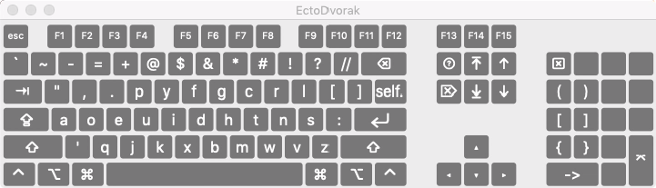
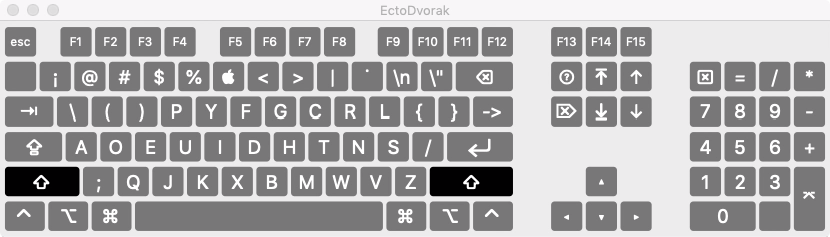
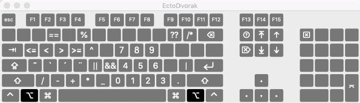
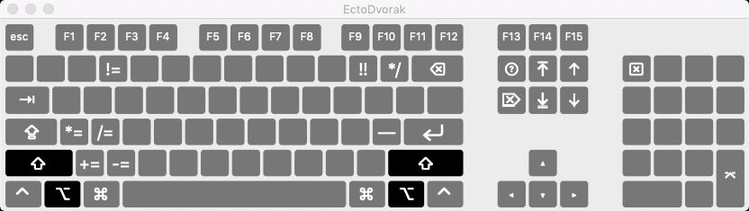
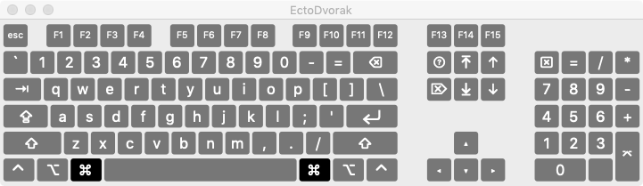

EctoDvorak keyboard layout for macOS
===========

EctoDvorak is mod of [DeepDvorak](https://github.com/vbauerster/DeepDvorak), which is a mod of [Programmer Dvorak](http://www.kaufmann.no/roland/dvorak/index.html). Both variants do some interesting things, but this an attempt to steer things into another direction, at least initially set in motion by my needs while in Swift programmer mode.

While I'm inspired by their willingness to totally change up where numbers and symbols go, and many ideas are really great, I want to explore other possibilities.

One thing to note is that I *keep* the QWERTY positions for the command-keys, until I see a compelling reason not to. It's a touch of Stockholm Syndrome on my part, but a lot of those key positions were chosen for geometric as well as letter reasons.

The other big difference is that I'm not sold on the toggle-numbering. Currently I'm favoring numeric keypad style. I do, however, follow both of the previous keyboards in making the symbols on the top row primary and numbers secondary via the shift key. I'm puzzled why this wasn't done starting in the '60's.

As this is a work in progress, I'm leaving a lot of keys blank until I feel a need to put something in their place.

## Installation

 * Copy to a Keyboard Layouts directory:
   * Copying the bundle to /Library/Keyboard Layouts/ requires administrator rights to the computer, but will allow the layout system-wide, including the OS X login screen. To enable input options on the login window, check the option in System Preferences / Users & Groups / Login Options / Show Input menu in login window.
	* ~/Library/Keyboard Layouts/ needs less access and is specific to just the user’s account it is saved to.
 * Open System Preferences, click on the Language & Text icon, and in the Input Menu tab enable the Deep Dvorak layout.
 * Make sure that the Show input menu in menu bar box is also checked.
 * To switch quickly between layouts you can press Command+Space or Command+Option+Space. Note, this hotkey combination conflicts with the default settings for showing Spotlight. Check your settings in System Preferences, Keyboard, Keyboard Shortcuts tab, Spotlight against Keyboard & Text Input.

### Screenshots

* **Normal state**

The single and double quote keys have been moved to mirror pinky positions (single on the left because of the position of the s key). The + and = keys are very frequently used in programming. += and -= become very quick gestures with no metakeys being held down. Two ! and = keys so far. Probably the right ! is unnecessary, but the two = signs feels surprisingly nice to have. I tend to use both as frequently.

* **SHIFT ⇧**

Extremely easy access to paretheses, and in Swift having such easy access to \() is a nice luxury. Splitting up \ and / on opposite sides, both in easy-to-hit positions, is comfortable and a nice break from their normal grouping, much like the separation of quotations in the normal keyboard above. < and > evolved into their spots to make them at least reasonable when you are thinking of them. The programmer may also get a kick out of having one-key access to \n \\" and ->.

[comment]: <> (* **Caps lock ⇪** !Shift state screenshots/caps.png)

* **OPTION ⌥**

All hell breaks loose here, but there is some interesting experimentation. The numbers being here does feel pretty good, though I realize it seems pretty redundant if you use a keypad. Some things will almost certainly still change, like \ | and /. The best moments of this layout, as judged by constant use and easy of memorizing, are $0 $1 == || && and //. As well, having the couplet of the block comment symbols on the same key is nice.

* **SHIFT+OPTION ⇧+⌥**

Not much going on here so far. It offers variants to matching keys from the Option layout. Lots of room here, but who likes hitting shift and option at the same time?

[comment]: <> (* **Dead state** !Dead state screenshots/dead.png)

* **Command ⌘**

Nothing to say here, just standard qwerty command keys.

