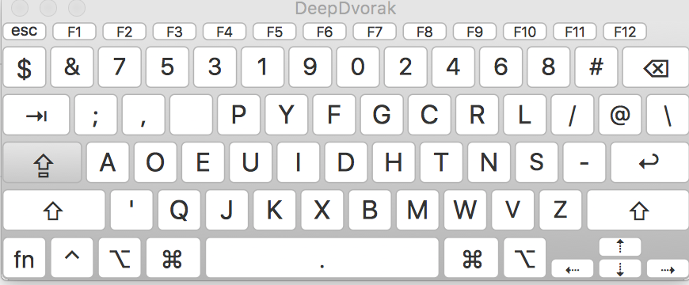
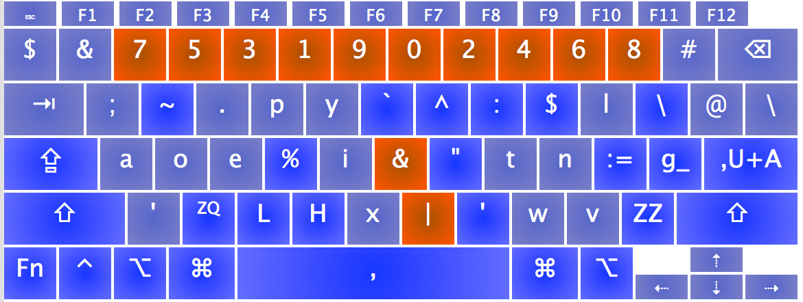

EctoDvorak keyboard layout for MacOS
===========

EctoDvorak is mod of [DeepDvorak](https://github.com/vbauerster/DeepDvorak), which is a mod of [Programmer Dvorak](http://www.kaufmann.no/roland/dvorak/index.html). Both variants do some interesting things, but this an attempt to steer things into another direction, at least initially set in motion by my needs while in Swift programmer mode.

## Installation

 * Copy to a Keyboard Layouts directory:
   * Copying the bundle to /Library/Keyboard Layouts/ requires administrator rights to the computer, but will allow the layout system-wide, including the OS X login screen. To enable input options on the login window, check the option in System Preferences / Users & Groups / Login Options / Show Input menu in login window.
	* ~/Library/Keyboard Layouts/ needs less access and is specific to just the user’s account it is saved to.
 * Open System Preferences, click on the Language & Text icon, and in the Input Menu tab enable the Deep Dvorak layout.
 * Make sure that the Show input menu in menu bar box is also checked.
 * To switch quickly between layouts you can press Command+Space or Command+Option+Space. Note, this hotkey combination conflicts with the default settings for showing Spotlight. Check your settings in System Preferences, Keyboard, Keyboard Shortcuts tab, Spotlight against Keyboard & Text Input.

### Screenshots

* **Normal state**

* **SHIFT ⇧**

* **Caps lock ⇪**

* **Command ⌘**

* **OPTION ⌥**

* **SHIFT+OPTION  (⇧+⌥)**

* **Dead state**

