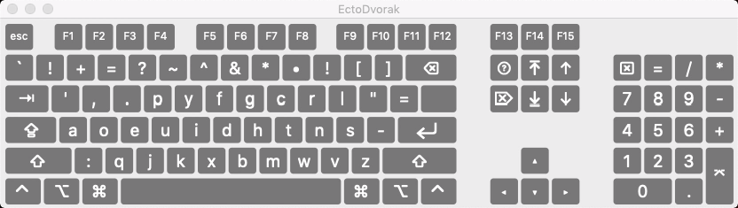
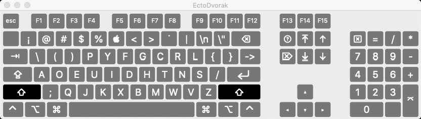
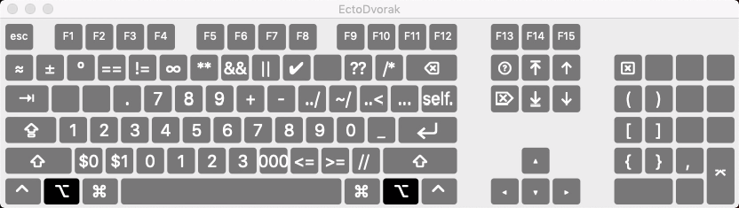
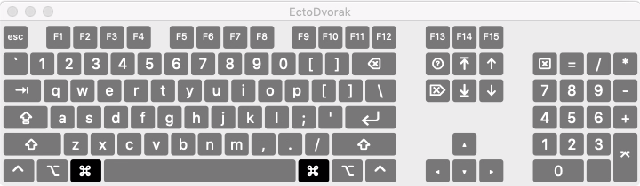

EctoDvorak keyboard layout for macOS
===========

EctoDvorak is mod of [DeepDvorak](https://github.com/vbauerster/DeepDvorak), which is a mod of [Programmer Dvorak](http://www.kaufmann.no/roland/dvorak/index.html). Both variants do some interesting things, but this an attempt to steer things into another direction, at least initially set in motion by my needs while in Swift programmer mode.

While I'm inspired by their willingness to totally change up where numbers and symbols go, and many ideas are really great, I want to explore other possibilities.

One thing to note is that I *keep* the QWERTY positions for the command-keys, until I see a compelling reason not to. It's a touch of Stockholm Syndrome on my part, but a lot of those key positions were chosen for geometric as well as letter reasons.

The other big difference is that I'm not sold on the toggle-numbering. I'd rather have numeric keypad style or linear, and this keyboard gives both options to fit your mood. I follow both of the previous keyboards in making the symbols on the top row primary and the numbers secondary via the shift key. I'm puzzled this wasn't done starting in the '60's.

As this is a work in progress, I'm leaving a lot of keys blank until I feel a need to put something in their place.

## Installation

 * Copy to a Keyboard Layouts directory:
   * Copying the bundle to /Library/Keyboard Layouts/ requires administrator rights to the computer, but will allow the layout system-wide, including the OS X login screen. To enable input options on the login window, check the option in System Preferences / Users & Groups / Login Options / Show Input menu in login window.
	* ~/Library/Keyboard Layouts/ needs less access and is specific to just the user’s account it is saved to.
 * Open System Preferences, click on the Language & Text icon, and in the Input Menu tab enable the Deep Dvorak layout.
 * Make sure that the Show input menu in menu bar box is also checked.
 * To switch quickly between layouts you can press Command+Space or Command+Option+Space. Note, this hotkey combination conflicts with the default settings for showing Spotlight. Check your settings in System Preferences, Keyboard, Keyboard Shortcuts tab, Spotlight against Keyboard & Text Input.

### Screenshots

* **Normal state**

I'm not sure about the utility of the "self." key here, but the simple access to common symbols on the top row feels good so far. I really like the bottom row single-quote and having ready access to double-quotes without shift on a different key. It seems right separating them, especially while programming. I'll probably be moving the dash key. Stretching my 4th finger up there seems like too much for such a commonly used character. Also, the equals symbol seems a bit out of the way too.

* **SHIFT ⇧**

Most of the top row is blank. Fairly nice access to parentheses. The same spot gives <> when using the option key. Curly braces overlap where braces are un-shifted. Testing out that unusual spot for ! but it feels good so far.

[comment]: <> (* **Caps lock ⇪** !Shift state screenshots/caps.png)

* **OPTION ⌥**

This is pretty odd still. The numbers being here does feel pretty good. Probably too odd to keep /* where it is. I like the idea of lining up division to multiplication, and similar for the assignment variations, left to right like that. Still very experimental here overall.

[comment]: <> (* **SHIFT+OPTION  (⇧+⌥** !Shift+Option state screenshots/alt-shift.png)

[comment]: <> (* **Dead state** !Dead state screenshots/dead.png)

* **Command ⌘**

Nothing to say here, just standard qwerty command keys.

